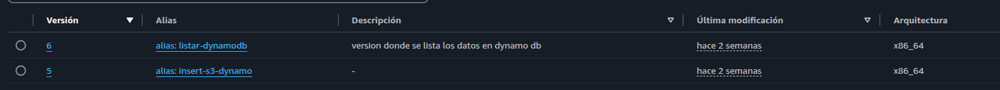
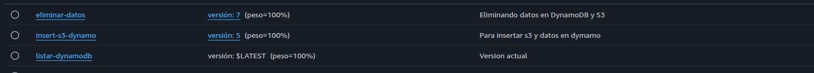
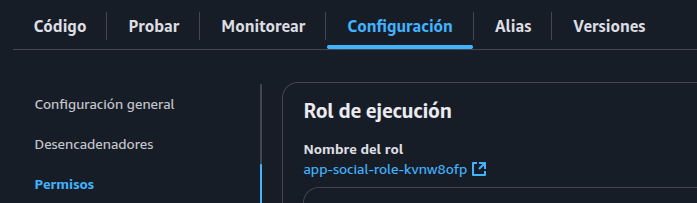
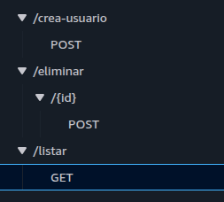
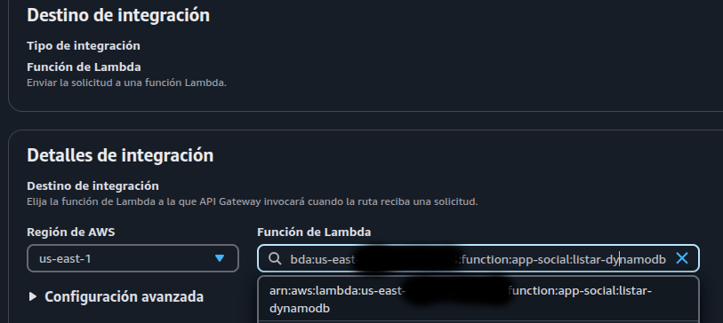

# React + ChakraUI + AWS (DynamoDB - S3 - API Gateway - Lambda - CloudFront)

Este proyecto implementa un sistema de registro utilizando varios servicios de AWS: Lambda, DynamoDB, S3, API Gateway y CloudFront.  

La lógica consiste en almacenar los datos del usuario en **DynamoDB** y subir un archivo adjunto a **S3**. Ambos procesos son gestionados a través de **AWS Lambda**, expuestos mediante **API Gateway**, y los archivos son servidos a través de **CloudFront**.


## Pasos para replicar el proyecto

1. **Asignar permisos a Lambda**  
   Crea un rol de ejecución para tu función Lambda con políticas que permitan acceso a DynamoDB y S3. Puedes usar el archivo de permisos ubicado en:  
   `src/pages/aws/lambda/permisos/lambda-rol.json`.

2. **Configurar API Gateway**  
   Crea una API de tipo **HTTP** en API Gateway. Define tres rutas (insertar, listar y eliminar) y asócialas a diferentes versiones (aliases) de tu función Lambda.

3. **Crear funciones Lambda y versiones**  
   Implementa una única función Lambda y publica tres versiones:  
   - Insertar datos  
   - Listar datos  
   - Eliminar datos  

   Esto te permitirá aprender a trabajar con versiones y aliases. El código fuente está en:  
   `src/pages/aws/lambda`.

4. **Configurar CloudFront**  
   Crea una distribución en **CloudFront** con origen apuntando a tu bucket de S3. La URL generada se debe utilizar en el archivo:  
   `src/pages/aws/lambda/config.js`.

5. **Crear bucket S3**  
   - Habilita el **bloqueo de acceso público completo**.  
   - CloudFront se encargará de servir los archivos, así que no necesitas exponer directamente el bucket.  
   - Asegúrate de agregar el **Origin Access Control (OAC)** para que CloudFront pueda leer desde S3. Aplica las políticas necesarias en el bucket.

6. **Permisos S3 para CloudFront**  
   Agrega la política de acceso recomendada por CloudFront al bucket S3. Esto es fundamental para permitir la lectura de archivos.

---

## Lambda

En `src/pages/aws/lambda/` encontrarás tres archivos, cada uno representa una acción diferente.  
Debes publicar una versión de Lambda por cada archivo y asignarle un alias.



##### Alias
Ejemplo de cómo configurar los aliases:



#### Permisos
Ubicación del archivo de políticas para el rol Lambda:

`src/pages/aws/lambda/permisos/lambda-rol.json`



---

## API Gateway

Crea tres rutas en tu API Gateway. Los nombres pueden variar, pero asegúrate de actualizar las URLs correspondientes en:  
`src/pages/aws/hook/useAwsHook.ts`



Cada ruta debe invocar la versión de Lambda correspondiente (usando el alias creado).



> Recomendación: Usa Postman para probar los endpoints mientras desarrollas.

---

## S3

Crea una distribución en CloudFront asociada a tu bucket S3 y configura los permisos necesarios para que los archivos puedan ser servidos correctamente.

---

## DynamoDB

Crea una tabla con:
- Partition key: `id`
- Tipo: `string`

Si decides cambiar el nombre o tipo, actualiza el código en Lambda para reflejar esa estructura.

---

## Tecnologías utilizadas

1. **Frontend**: React (v19) + Chakra UI  
2. **HTTP Client**: Axios  
    Se define un cliente con una variable de entorno para facilitar el uso de rutas relativas:

```ts
// src/pages/aws/service-api.ts
import axios from "axios";

export const api_client = axios.create({
    baseURL: import.meta.env.VITE_api,
    timeout: 5000,
    headers: {
        'Content-Type': 'application/json',
    }
});
```

#### Ejemplo de como se usa
```ts
const { data } = await api_client.post('eliminar/' + id);
```

3. **Backend**: Lambda + API Gateway
4. **Almacenamiento**: DynamoDB (datos) y S3 (archivos)
5. **Distribución de archivos**: CloudFront.
6. **Lenguaje**: TypeScript


## Instalación
```bash
#Clona el repositorio
git clone https://github.com/cristhiancustodio/proyectoaws.git
#Instala los paquetes npm
npm install
#Inicia el proyecto
npm run dev
```
#### Coloca tu api en el .env
```
VITE_api = 
```
# IMPORTANTE!

Si tu navegador bloquea las peticiones a tu API local, asegúrate de configurar correctamente los CORS en API Gateway. Busca en ChatGPT "Configurar CORS en API Gateway"

# Usar AWS Amplify para probar tu proyecto
Si deseas que otros prueben tu proyecto, puedes desplegarlo en AWS Amplify conectándolo a tu repositorio de GitHub.
Asegúrate de proteger tu API. Sin autenticación o limitación de uso, otros usuarios pueden hacer múltiples solicitudes POST o subir grandes volúmenes de archivos, lo aumentaria tus costos en AWS (principalmente en S3 y API Gateway).